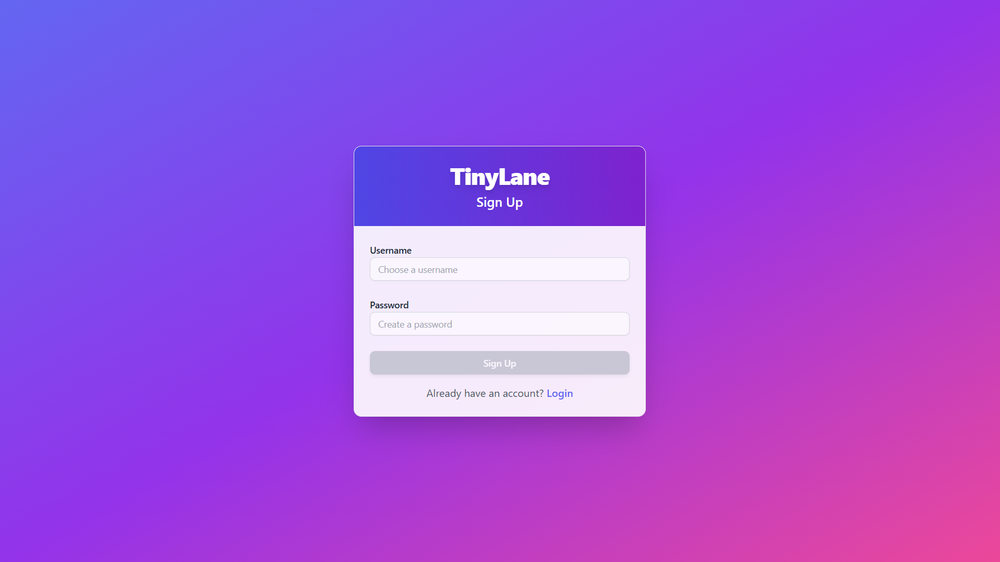
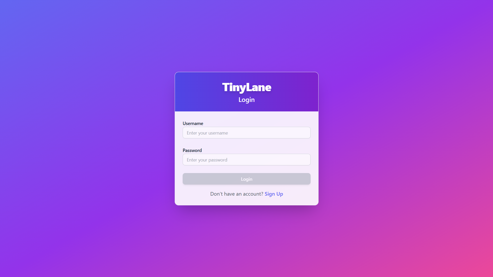
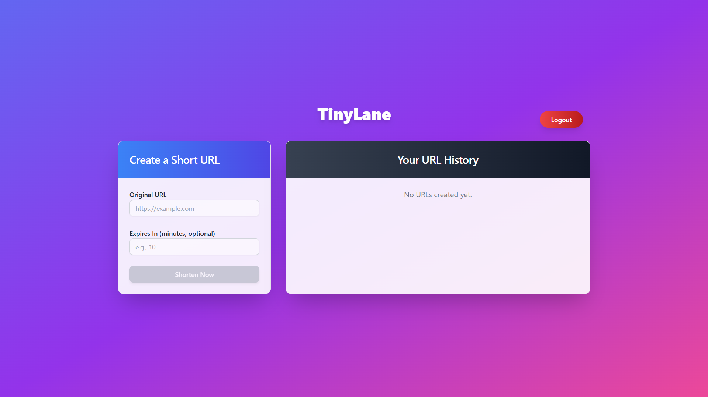
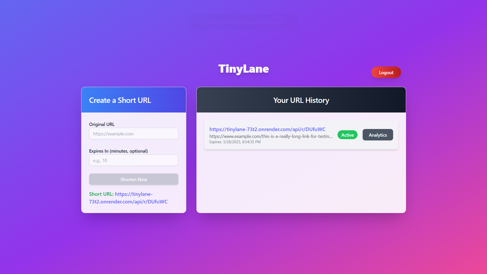
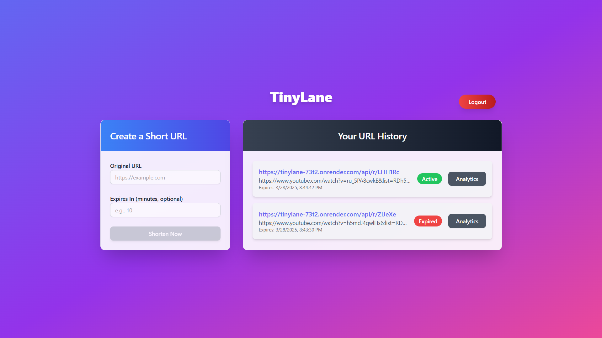
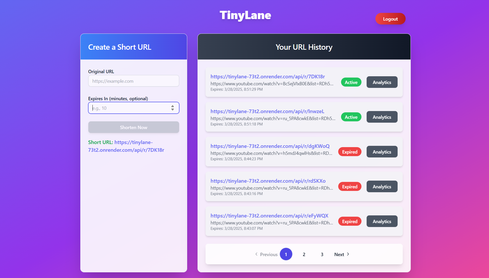
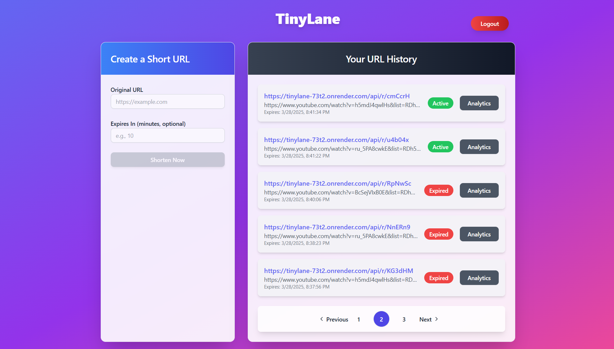

# TinyLane - URL Shortener

TinyLane is a URL shortening service similar to Bit.ly, designed to transform long URLs into short, unique links that redirect to the original URL. It offers features like click tracking, analytics, and expiration management, making it a powerful tool for users to manage and analyze their links.

## 🔗 Live Demo
- **Live Version**: [https://tinylane.vercel.app/](https://tinylane.vercel.app/)

## 📸 Demo Screenshots
| Feature          | Image |
|-----------------|-------|
| SignUp        |  |
| Login|  |
| Login successful     |  |
| Short URL Output       |  |
| Homepage    |  |
| Homepage   |  |
| Homepage      |  |
| Analytics     |  |


## 🎯 Objective
Build a URL shortener where users can:
- Enter a long URL and receive a short, unique URL (e.g., `tinylane.vercel.app/abc123`).
- Track clicks, analytics, and expiration times for each shortened URL.

## 🛠️ Tech Stack
- **Frontend**: React (Deployed on Vercel)
- **Backend**: Python/Django with MySQL (Deployed on Render)
- **Database**: MySQL (local development), PostgreSQL (Render production)
- **Background Tasks**: Celery with Redis for auto-deleting expired URLs

## ✨ Features
1. **URL Shortening**
   - Users enter a long URL, and TinyLane generates a unique short URL (e.g., `tinylane.vercel.app/abc123`).
2. **URL History**
   - Users can view their past shortened URLs with details including:
     - Original URL
     - Short URL
     - Creation date
     - Expiration date (if set)
     - **Status**: Active or Expired
3. **Click Tracking & Analytics**
   - Logs each click with:
     - Number of times the link is accessed
     - Timestamp of each click
     - IP address of the visitor
4. **Expiration Management**
   - Users can set an expiration date for short URLs.
   - Expired URLs are auto-deleted via a Celery background task.
5. **User-Friendly Interface**
   - Simple React-based frontend for URL submission and history viewing.

## 📂 Project Structure
```
TinyLane/
├── frontend/           # React frontend code
│   ├── src/
│   └── package.json
├── backend/            # Django backend code
│   ├── backend/        # Django project settings
│   ├── shortener/      # Django app for URL logic
│   ├── manage.py
│   └── requirements.txt
└── README.md
```

## 🚀 Setup Instructions

### Prerequisites
- Node.js (for frontend)
- Python 3.9+ (for backend)
- MySQL (local dev) or PostgreSQL (production)
- Redis (for Celery)
- Git

### 🔧 Backend Setup (Local)
1. Clone the repository:
   ```bash
   git clone https://github.com/your-username/TinyLane.git
   cd TinyLane/backend
   ```
2. Create and activate a virtual environment:
   ```bash
   python -m venv venv
   .\venv\Scripts\activate  # Windows
   source venv/bin/activate  # macOS/Linux
   ```
3. Install dependencies:
   ```bash
   pip install -r requirements.txt
   ```
4. Configure MySQL:
   - Create a database: `url_shortener_db`
   - Update `backend/settings.py` with your MySQL credentials.
5. Run migrations:
   ```bash
   python manage.py migrate
   ```
6. Start the Django server:
   ```bash
   python manage.py runserver
   ```

### 🎨 Frontend Setup (Local)
1. Navigate to the frontend directory:
   ```bash
   cd ../frontend
   ```
2. Install dependencies:
   ```bash
   npm install
   ```
3. Start the React app:
   ```bash
   npm start
   ```
   Runs on http://localhost:5173.

### ⚙️ Running Celery (Local)
1. Start Redis:
   ```bash
   docker run -d -p 6379:6379 redis:alpine
   ```
2. Run Celery worker and beat:
   ```bash
   celery -A backend worker --loglevel=info
   celery -A backend beat --loglevel=info
   ```

## 🌍 Deployment
- **Live Version**: Deployed on Vercel at [https://tinylane.vercel.app/](https://tinylane.vercel.app/).
- Uses PostgreSQL and Redis managed services on Render.
- See `Procfile` for web, worker, and beat processes.

## 📬 Contact
📧 **Email:** [bhartirounak@gmail.com](mailto:bhartirounak@gmail.com)  
🔗 **GitHub:** [https://github.com/rounakbharti](https://github.com/rounakbharti)  
🌐 **Project Repository:** [TinyLane](https://github.com/rounakbharti/TinyLane)  

💡 *For any issues or suggestions, feel free to open a GitHub issue!* 🚀
